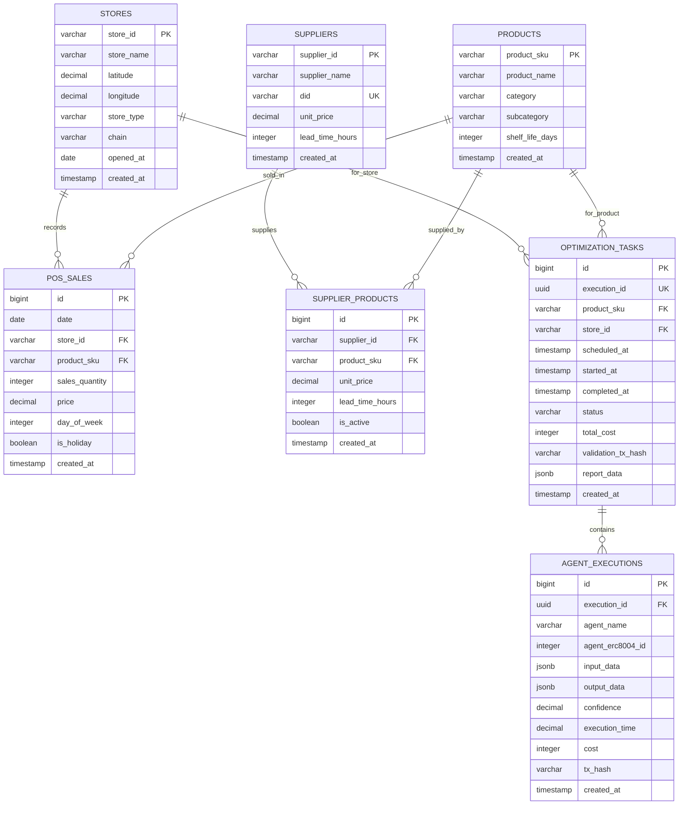

# データベーススキーマ（ER図） - 生鮮品サプライチェーン最適化AI協調システム

## ドキュメント情報

- **プロジェクト名**: 生鮮品サプライチェーン最適化AI協調システム
- **ドキュメントタイプ**: データベーススキーマ（ER図）
- **バージョン**: 1.0.0
- **最終更新**: 2025-01-22
- **DBMS**: PostgreSQL 15+

---

## 目次

1. [ER図](#1-er図)
2. [テーブル定義](#2-テーブル定義)
3. [インデックス戦略](#3-インデックス戦略)
4. [パーティショニング](#4-パーティショニング)

---

## 1. ER図

### 1.1 全体ER図



### 1.2 ER図の関係性

| リレーション | 関係 | 説明 |
|------------|------|------|
| STORES - POS_SALES | 1:N | 店舗は複数の販売記録を持つ |
| PRODUCTS - POS_SALES | 1:N | 商品は複数の販売記録を持つ |
| SUPPLIERS - SUPPLIER_PRODUCTS | 1:N | サプライヤーは複数商品を供給 |
| PRODUCTS - SUPPLIER_PRODUCTS | 1:N | 商品は複数サプライヤーから供給 |
| OPTIMIZATION_TASKS - AGENT_EXECUTIONS | 1:N | 1タスクは複数エージェント実行を含む |

---

## 2. テーブル定義

### 2.1 店舗マスタ（stores）

```sql
CREATE TABLE stores (
    store_id VARCHAR(50) PRIMARY KEY,
    store_name VARCHAR(200) NOT NULL,
    latitude DECIMAL(9, 6) NOT NULL,
    longitude DECIMAL(9, 6) NOT NULL,
    store_type VARCHAR(50),  -- 'flagship', 'standard', 'compact'
    chain VARCHAR(50),  -- 'existing', 'seiyu'
    opened_at DATE,
    created_at TIMESTAMP DEFAULT CURRENT_TIMESTAMP,
    updated_at TIMESTAMP DEFAULT CURRENT_TIMESTAMP,
    
    CONSTRAINT chk_store_type CHECK (store_type IN ('flagship', 'standard', 'compact')),
    CONSTRAINT chk_chain CHECK (chain IN ('existing', 'seiyu'))
);

COMMENT ON TABLE stores IS '店舗マスタ';
COMMENT ON COLUMN stores.store_id IS '店舗ID（例: S001）';
COMMENT ON COLUMN stores.latitude IS '緯度（気象データ取得用）';
COMMENT ON COLUMN stores.longitude IS '経度（気象データ取得用）';
```

---

### 2.2 商品マスタ（products）

```sql
CREATE TABLE products (
    product_sku VARCHAR(100) PRIMARY KEY,
    product_name VARCHAR(200) NOT NULL,
    category VARCHAR(100) NOT NULL,  -- '生鮮', '日配', '一般食品'
    subcategory VARCHAR(100),
    shelf_life_days INTEGER,  -- 賞味期限（日数）
    created_at TIMESTAMP DEFAULT CURRENT_TIMESTAMP,
    updated_at TIMESTAMP DEFAULT CURRENT_TIMESTAMP,
    
    CONSTRAINT chk_category CHECK (category IN ('生鮮', '日配', '一般食品', 'その他')),
    CONSTRAINT chk_shelf_life CHECK (shelf_life_days > 0)
);

CREATE INDEX idx_products_category ON products(category);

COMMENT ON TABLE products IS '商品マスタ';
COMMENT ON COLUMN products.product_sku IS '商品SKU（例: tomato-medium-domestic）';
COMMENT ON COLUMN products.shelf_life_days IS '賞味期限（日数）';
```

---

### 2.3 POS販売データ（pos_sales）

```sql
CREATE TABLE pos_sales (
    id BIGSERIAL PRIMARY KEY,
    date DATE NOT NULL,
    store_id VARCHAR(50) NOT NULL REFERENCES stores(store_id),
    product_sku VARCHAR(100) NOT NULL REFERENCES products(product_sku),
    sales_quantity INTEGER NOT NULL,
    price DECIMAL(10, 2) NOT NULL,
    day_of_week INTEGER NOT NULL,  -- 0=月曜, 6=日曜
    is_holiday BOOLEAN NOT NULL DEFAULT FALSE,
    created_at TIMESTAMP DEFAULT CURRENT_TIMESTAMP,
    
    CONSTRAINT chk_sales_quantity CHECK (sales_quantity >= 0),
    CONSTRAINT chk_price CHECK (price >= 0),
    CONSTRAINT chk_day_of_week CHECK (day_of_week BETWEEN 0 AND 6)
) PARTITION BY RANGE (date);

-- パーティション作成（年次）
CREATE TABLE pos_sales_2023 PARTITION OF pos_sales
    FOR VALUES FROM ('2023-01-01') TO ('2024-01-01');

CREATE TABLE pos_sales_2024 PARTITION OF pos_sales
    FOR VALUES FROM ('2024-01-01') TO ('2025-01-01');

CREATE TABLE pos_sales_2025 PARTITION OF pos_sales
    FOR VALUES FROM ('2025-01-01') TO ('2026-01-01');

CREATE INDEX idx_pos_sales_product_store_date 
    ON pos_sales(product_sku, store_id, date);

CREATE INDEX idx_pos_sales_date ON pos_sales(date);

COMMENT ON TABLE pos_sales IS 'POS販売データ（3年分保持）';
COMMENT ON COLUMN pos_sales.day_of_week IS '曜日（0=月, 1=火, ..., 6=日）';
```

---

### 2.4 サプライヤーマスタ（suppliers）

```sql
CREATE TABLE suppliers (
    supplier_id VARCHAR(50) PRIMARY KEY,
    supplier_name VARCHAR(200) NOT NULL,
    did VARCHAR(200) UNIQUE,  -- DID識別子（例: did:web:supplier-a.example.com）
    contact_email VARCHAR(200),
    contact_phone VARCHAR(50),
    created_at TIMESTAMP DEFAULT CURRENT_TIMESTAMP,
    updated_at TIMESTAMP DEFAULT CURRENT_TIMESTAMP
);

CREATE INDEX idx_suppliers_did ON suppliers(did);

COMMENT ON TABLE suppliers IS 'サプライヤーマスタ';
COMMENT ON COLUMN suppliers.did IS 'DID識別子（DID/VC基盤連携用）';
```

---

### 2.5 サプライヤー商品関連（supplier_products）

```sql
CREATE TABLE supplier_products (
    id BIGSERIAL PRIMARY KEY,
    supplier_id VARCHAR(50) NOT NULL REFERENCES suppliers(supplier_id),
    product_sku VARCHAR(100) NOT NULL REFERENCES products(product_sku),
    unit_price DECIMAL(10, 2) NOT NULL,
    lead_time_hours INTEGER NOT NULL,  -- リードタイム（時間）
    is_active BOOLEAN NOT NULL DEFAULT TRUE,
    created_at TIMESTAMP DEFAULT CURRENT_TIMESTAMP,
    updated_at TIMESTAMP DEFAULT CURRENT_TIMESTAMP,
    
    CONSTRAINT uq_supplier_product UNIQUE(supplier_id, product_sku),
    CONSTRAINT chk_unit_price CHECK (unit_price >= 0),
    CONSTRAINT chk_lead_time CHECK (lead_time_hours > 0)
);

CREATE INDEX idx_supplier_products_product ON supplier_products(product_sku);
CREATE INDEX idx_supplier_products_active ON supplier_products(is_active);

COMMENT ON TABLE supplier_products IS 'サプライヤー商品関連テーブル';
COMMENT ON COLUMN supplier_products.lead_time_hours IS 'リードタイム（時間）';
```

---

### 2.6 最適化タスク（optimization_tasks）

```sql
CREATE TABLE optimization_tasks (
    id BIGSERIAL PRIMARY KEY,
    execution_id UUID NOT NULL UNIQUE DEFAULT gen_random_uuid(),
    product_sku VARCHAR(100) NOT NULL REFERENCES products(product_sku),
    store_id VARCHAR(50) NOT NULL REFERENCES stores(store_id),
    scheduled_at TIMESTAMP NOT NULL,
    started_at TIMESTAMP,
    completed_at TIMESTAMP,
    status VARCHAR(20) NOT NULL DEFAULT 'pending',
    total_cost INTEGER,  -- 合計コスト（JPYC）
    validation_tx_hash VARCHAR(66),  -- 検証結果のTxハッシュ
    report_data JSONB,
    created_at TIMESTAMP DEFAULT CURRENT_TIMESTAMP,
    updated_at TIMESTAMP DEFAULT CURRENT_TIMESTAMP,
    
    CONSTRAINT chk_status CHECK (status IN ('pending', 'queued', 'running', 'completed', 'failed'))
);

CREATE INDEX idx_optimization_tasks_status ON optimization_tasks(status);
CREATE INDEX idx_optimization_tasks_scheduled ON optimization_tasks(scheduled_at);
CREATE INDEX idx_optimization_tasks_product_store ON optimization_tasks(product_sku, store_id);
CREATE INDEX idx_optimization_tasks_execution_id ON optimization_tasks(execution_id);

COMMENT ON TABLE optimization_tasks IS '最適化タスクテーブル';
COMMENT ON COLUMN optimization_tasks.execution_id IS '実行ID（UUID）';
COMMENT ON COLUMN optimization_tasks.validation_tx_hash IS 'ERC-8004 Validation記録のトランザクションハッシュ';
```

---

### 2.7 エージェント実行履歴（agent_executions）

```sql
CREATE TABLE agent_executions (
    id BIGSERIAL PRIMARY KEY,
    execution_id UUID NOT NULL REFERENCES optimization_tasks(execution_id),
    agent_name VARCHAR(100) NOT NULL,
    agent_erc8004_id INTEGER,  -- ERC-8004エージェントID
    input_data JSONB NOT NULL,
    output_data JSONB NOT NULL,
    confidence DECIMAL(3, 2),  -- 0.00 - 1.00
    execution_time DECIMAL(10, 3),  -- 秒
    cost INTEGER,  -- JPYC
    tx_hash VARCHAR(66),  -- ブロックチェーントランザクションハッシュ
    created_at TIMESTAMP DEFAULT CURRENT_TIMESTAMP,
    
    CONSTRAINT chk_confidence CHECK (confidence BETWEEN 0 AND 1)
);

CREATE INDEX idx_agent_executions_execution_id ON agent_executions(execution_id);
CREATE INDEX idx_agent_executions_agent_name ON agent_executions(agent_name);
CREATE INDEX idx_agent_executions_created_at ON agent_executions(created_at);
CREATE INDEX idx_agent_executions_erc8004_id ON agent_executions(agent_erc8004_id);

COMMENT ON TABLE agent_executions IS 'エージェント実行履歴';
COMMENT ON COLUMN agent_executions.agent_erc8004_id IS 'ERC-8004 Identity RegistryのagentId';
COMMENT ON COLUMN agent_executions.confidence IS '信頼度スコア（0.0〜1.0）';
```

---

### 2.8 在庫データ（inventory）

```sql
CREATE TABLE inventory (
    id BIGSERIAL PRIMARY KEY,
    store_id VARCHAR(50) NOT NULL REFERENCES stores(store_id),
    product_sku VARCHAR(100) NOT NULL REFERENCES products(product_sku),
    date DATE NOT NULL,
    inventory_quantity INTEGER NOT NULL DEFAULT 0,
    created_at TIMESTAMP DEFAULT CURRENT_TIMESTAMP,
    updated_at TIMESTAMP DEFAULT CURRENT_TIMESTAMP,
    
    CONSTRAINT uq_inventory_store_product_date UNIQUE(store_id, product_sku, date),
    CONSTRAINT chk_inventory_quantity CHECK (inventory_quantity >= 0)
);

CREATE INDEX idx_inventory_store_product ON inventory(store_id, product_sku);
CREATE INDEX idx_inventory_date ON inventory(date);

COMMENT ON TABLE inventory IS '在庫データ（日次スナップショット）';
```

---

### 2.9 発注履歴（orders）

```sql
CREATE TABLE orders (
    id BIGSERIAL PRIMARY KEY,
    order_id VARCHAR(100) UNIQUE NOT NULL,
    execution_id UUID REFERENCES optimization_tasks(execution_id),
    store_id VARCHAR(50) NOT NULL REFERENCES stores(store_id),
    product_sku VARCHAR(100) NOT NULL REFERENCES products(product_sku),
    supplier_id VARCHAR(50) NOT NULL REFERENCES suppliers(supplier_id),
    order_quantity INTEGER NOT NULL,
    unit_price DECIMAL(10, 2) NOT NULL,
    total_price DECIMAL(10, 2) NOT NULL,
    order_time TIMESTAMP NOT NULL,
    expected_delivery TIMESTAMP,
    actual_delivery TIMESTAMP,
    status VARCHAR(20) NOT NULL DEFAULT 'pending',
    created_at TIMESTAMP DEFAULT CURRENT_TIMESTAMP,
    updated_at TIMESTAMP DEFAULT CURRENT_TIMESTAMP,
    
    CONSTRAINT chk_order_status CHECK (status IN ('pending', 'confirmed', 'shipped', 'delivered', 'cancelled')),
    CONSTRAINT chk_order_quantity CHECK (order_quantity > 0),
    CONSTRAINT chk_total_price CHECK (total_price = order_quantity * unit_price)
);

CREATE INDEX idx_orders_store_product ON orders(store_id, product_sku);
CREATE INDEX idx_orders_status ON orders(status);
CREATE INDEX idx_orders_order_time ON orders(order_time);

COMMENT ON TABLE orders IS '発注履歴';
COMMENT ON COLUMN orders.execution_id IS '最適化タスクのexecution_id（AI推奨発注の場合）';
```

---

## 3. インデックス戦略

### 3.1 インデックス一覧

| テーブル | インデックス名 | カラム | 目的 |
|---------|--------------|--------|------|
| **pos_sales** | `idx_pos_sales_product_store_date` | (product_sku, store_id, date) | 需要予測クエリ高速化 |
| **pos_sales** | `idx_pos_sales_date` | (date) | 日付範囲検索 |
| **optimization_tasks** | `idx_optimization_tasks_status` | (status) | ステータスフィルタ |
| **optimization_tasks** | `idx_optimization_tasks_scheduled` | (scheduled_at) | スケジューラー用 |
| **agent_executions** | `idx_agent_executions_execution_id` | (execution_id) | タスク単位の実行履歴取得 |

### 3.2 複合インデックスの選定理由

**pos_sales(product_sku, store_id, date)**
```sql
-- 需要予測エージェントの典型的なクエリ
SELECT date, sales_quantity, price, day_of_week
FROM pos_sales
WHERE product_sku = 'tomato-medium-domestic'
  AND store_id = 'S001'
  AND date >= CURRENT_DATE - INTERVAL '3 years'
ORDER BY date;
```
→ (product_sku, store_id, date)の順でインデックスを作成することで、WHERE句とORDER BY句を最適化

---

## 4. パーティショニング

### 4.1 pos_salesテーブルのパーティショニング

**戦略**: 年次レンジパーティショニング

**理由**:
- 過去3年分のデータ（約1095日分）を保持
- 古いデータの削除が容易（DROP PARTITION）
- クエリパフォーマンスの向上（パーティションプルーニング）

**パーティション管理スクリプト**:
```sql
-- 新年度のパーティション作成（毎年実行）
CREATE TABLE pos_sales_2026 PARTITION OF pos_sales
    FOR VALUES FROM ('2026-01-01') TO ('2027-01-01');

-- 古いパーティションの削除（3年経過後）
DROP TABLE pos_sales_2022;
```

---

## 5. データ保持ポリシー

### 5.1 保持期間

| テーブル | 保持期間 | 削除方法 |
|---------|---------|---------|
| **pos_sales** | 3年 | パーティションDROP |
| **agent_executions** | 1年 | バッチ削除 |
| **optimization_tasks** | 1年 | バッチ削除 |
| **inventory** | 1年 | バッチ削除 |
| **orders** | 永続 | なし（監査用） |

### 5.2 アーカイブ戦略

```sql
-- 古いエージェント実行履歴のアーカイブ（月次バッチ）
CREATE TABLE agent_executions_archive (
    LIKE agent_executions INCLUDING ALL
);

INSERT INTO agent_executions_archive
SELECT * FROM agent_executions
WHERE created_at < CURRENT_DATE - INTERVAL '1 year';

DELETE FROM agent_executions
WHERE created_at < CURRENT_DATE - INTERVAL '1 year';
```

---

## 6. データ整合性制約

### 6.1 外部キー制約

すべての外部キー制約には`ON DELETE RESTRICT`を設定し、参照整合性を保証。

**例外**: `optimization_tasks.execution_id`と`agent_executions.execution_id`は`ON DELETE CASCADE`を設定し、タスク削除時にエージェント実行履歴も削除。

### 6.2 CHECK制約

- 数値の範囲チェック（価格、数量は0以上）
- 列挙型の値チェック（status、categoryなど）
- 日付の妥当性チェック

---

## 7. パフォーマンス最適化

### 7.1 VACUUM設定

```sql
-- 自動VACUUMの設定
ALTER TABLE pos_sales SET (autovacuum_vacuum_scale_factor = 0.05);
ALTER TABLE agent_executions SET (autovacuum_vacuum_scale_factor = 0.1);
```

### 7.2 統計情報の更新

```sql
-- 統計情報の手動更新（週次）
ANALYZE pos_sales;
ANALYZE optimization_tasks;
ANALYZE agent_executions;
```

---

## 8. セキュリティ

### 8.1 ロール設計

```sql
-- 読み取り専用ロール
CREATE ROLE a2a_readonly;
GRANT SELECT ON ALL TABLES IN SCHEMA public TO a2a_readonly;

-- アプリケーションロール
CREATE ROLE a2a_app;
GRANT SELECT, INSERT, UPDATE ON ALL TABLES IN SCHEMA public TO a2a_app;

-- 管理者ロール
CREATE ROLE a2a_admin;
GRANT ALL PRIVILEGES ON ALL TABLES IN SCHEMA public TO a2a_admin;
```

### 8.2 行レベルセキュリティ（RLS）

```sql
-- 店舗別のアクセス制御（Phase 4で実装予定）
ALTER TABLE pos_sales ENABLE ROW LEVEL SECURITY;

CREATE POLICY pos_sales_store_policy ON pos_sales
    FOR SELECT
    USING (store_id = current_setting('app.current_store_id')::VARCHAR);
```

---

## 9. バックアップ戦略

### 9.1 バックアップスケジュール

| 種類 | 頻度 | 保持期間 | 方法 |
|------|------|---------|------|
| **フルバックアップ** | 日次 | 30日 | pg_dump |
| **増分バックアップ** | 1時間毎 | 7日 | WALアーカイブ |
| **スナップショット** | 週次 | 90日 | クラウドストレージ |

### 9.2 リストア手順

```bash
# フルバックアップからのリストア
pg_restore -d a2a_supply_chain backup_2025-01-24.dump

# ポイントインタイムリカバリ（PITR）
# 特定時刻までのWALログを適用
```

---

**作成日**: 2025-01-22  
**次回更新予定**: Phase 1実装完了時