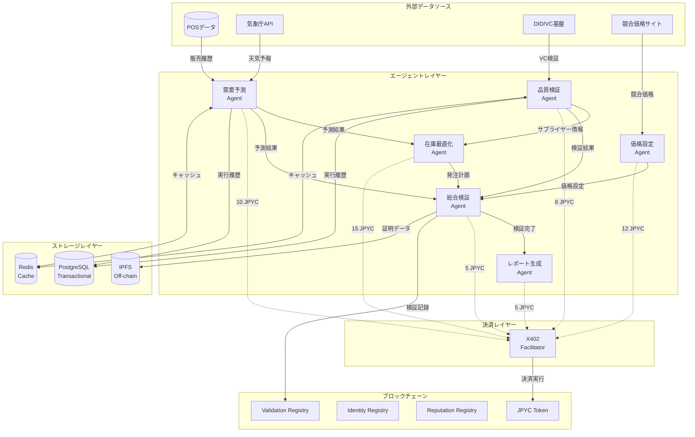
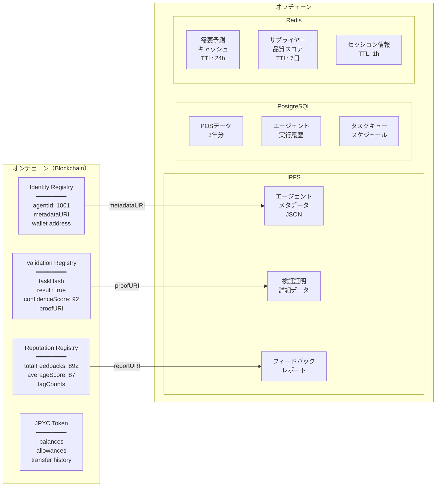
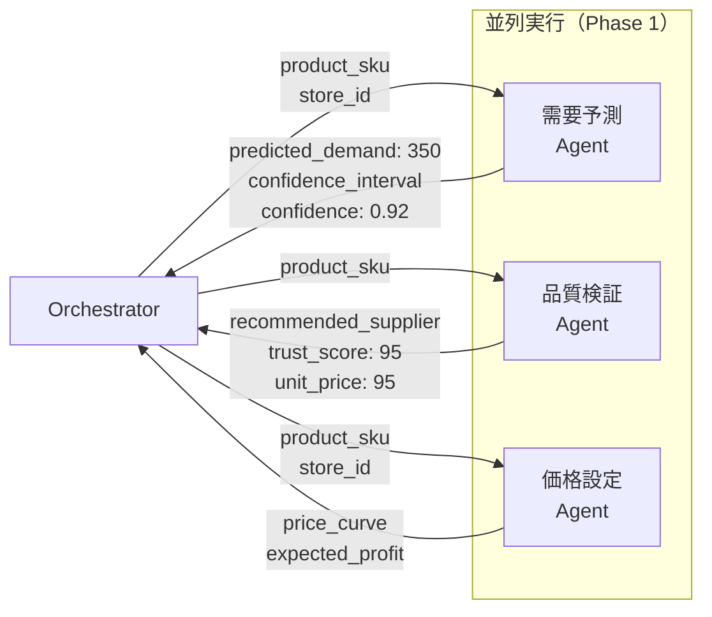
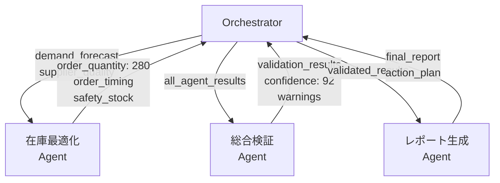
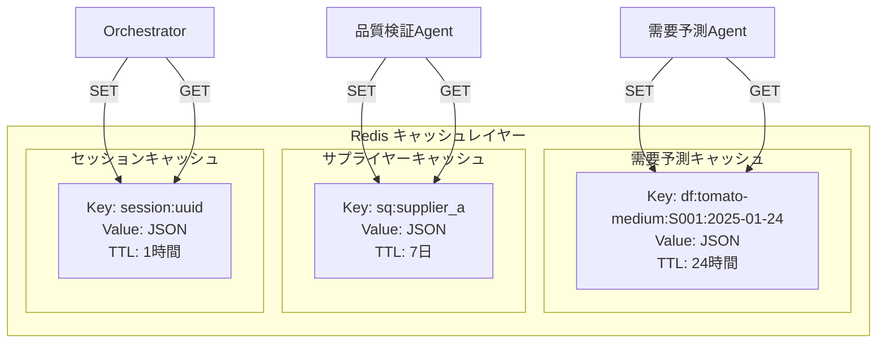
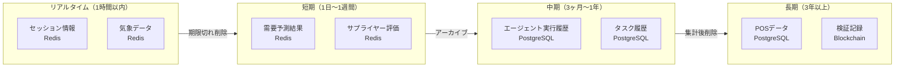
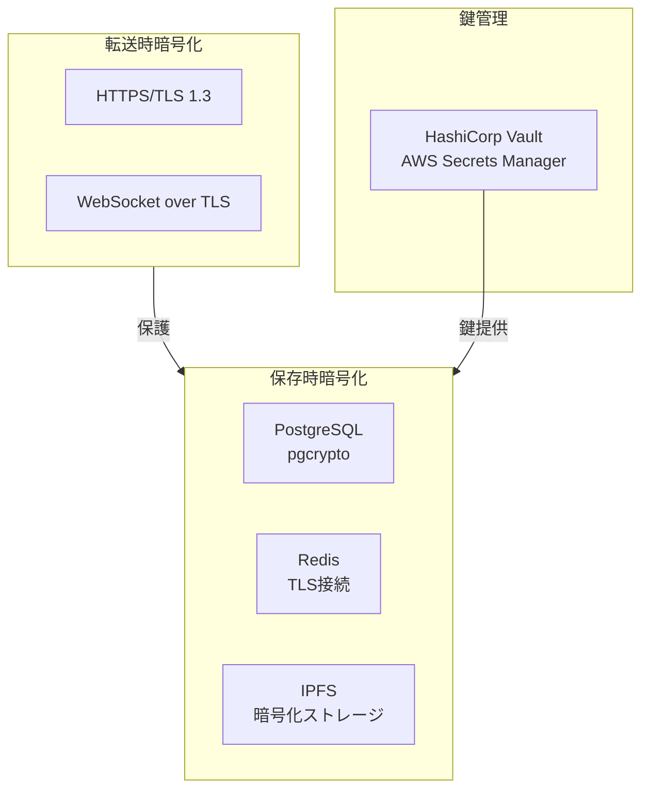

# データフロー図 - 生鮮品サプライチェーン最適化AI協調システム

## ドキュメント情報

- **プロジェクト名**: 生鮮品サプライチェーン最適化AI協調システム
- **ドキュメントタイプ**: データフロー図
- **バージョン**: 1.0.0
- **最終更新**: 2025-01-22

---

## 目次

1. [システム全体のデータフロー](#1-システム全体のデータフロー)
2. [オンチェーン/オフチェーンデータ分離](#2-オンチェーンオフチェーンデータ分離)
3. [エージェント間データフロー](#3-エージェント間データフロー)
4. [キャッシュ戦略](#4-キャッシュ戦略)

---

## 1. システム全体のデータフロー

### 1.1 レイヤー別データフロー図



### 1.2 データフロー説明

| データソース | データ種別 | 送信先 | 更新頻度 | データ量 |
|------------|----------|--------|---------|---------|
| **POSデータ** | 過去3年の販売履歴 | 需要予測エージェント | 日次 | ~1000行/商品 |
| **気象庁API** | 天気予報（気温・降水確率） | 需要予測エージェント | 6時間毎 | ~10KB |
| **DID/VC基盤** | サプライヤー認証情報 | 品質検証エージェント | リアルタイム | ~5KB/VC |
| **競合価格** | 他店舗の価格情報 | 価格設定エージェント | 日次 | ~50行 |

---

## 2. オンチェーン/オフチェーンデータ分離

### 2.1 データ配置戦略



### 2.2 データ配置の設計原則

| データ種別 | 配置先 | 理由 |
|----------|--------|------|
| **エージェント識別子** | オンチェーン（Identity Registry） | 一意性保証、改ざん防止 |
| **評価スコア** | オンチェーン（Reputation Registry） | 透明性、信頼性 |
| **検証結果ハッシュ** | オンチェーン（Validation Registry） | 監査証跡、改ざん防止 |
| **エージェント詳細情報** | オフチェーン（IPFS） | ガス代削減、柔軟性 |
| **POSデータ** | オフチェーン（PostgreSQL） | 高速クエリ、大容量対応 |
| **一時的な予測結果** | オフチェーン（Redis） | 高速アクセス、TTL管理 |

---

## 3. エージェント間データフロー

### 3.1 Phase 1: 並列実行フェーズ



### 3.2 Phase 2-4: 順次実行フェーズ



### 3.3 データ構造例

#### 需要予測エージェントの出力

```json
{
  "success": true,
  "data": {
    "predicted_demand": 350,
    "confidence_interval": {
      "lower": 320,
      "upper": 380
    },
    "features_used": [
      "day_of_week",
      "is_holiday",
      "temperature",
      "precipitation"
    ]
  },
  "confidence": 0.92,
  "execution_time": 8.2,
  "cost": 10
}
```

#### 在庫最適化エージェントの出力

```json
{
  "success": true,
  "data": {
    "order_quantity": 280,
    "supplier": {
      "id": "supplier_a",
      "name": "サプライヤーA",
      "unit_price": 95
    },
    "order_timing": "05:00",
    "safety_stock": 50,
    "expected_waste": 0,
    "expected_shortage": 1
  },
  "confidence": 0.89,
  "execution_time": 5.1,
  "cost": 15
}
```

---

## 4. キャッシュ戦略

### 4.1 Redis キャッシュ設計



### 4.2 キャッシュキー設計

| データ種別 | キーパターン | TTL | 理由 |
|----------|------------|-----|------|
| **需要予測** | `df:{sku}:{store}:{date}` | 24時間 | 日次予測、翌日は無効 |
| **サプライヤー品質** | `sq:{supplier_id}` | 7日 | 品質評価は週次更新 |
| **気象データ** | `weather:{store_id}:{date}` | 6時間 | 予報の更新頻度 |
| **セッション情報** | `session:{execution_id}` | 1時間 | 一時的な状態管理 |

### 4.3 キャッシュヒット率の目標

| エージェント | キャッシュ対象 | 目標ヒット率 | 効果 |
|------------|--------------|------------|------|
| **需要予測** | POSデータ特徴量 | 80% | DB負荷削減 |
| **品質検証** | サプライヤースコア | 90% | DID/VC API呼び出し削減 |
| **価格設定** | 競合価格 | 70% | スクレイピング頻度削減 |

---

## 5. データライフサイクル

### 5.1 データの保持期間



### 5.2 データアーカイブ戦略

| データ種別 | 保持期間（ホット） | アーカイブ期間 | 削除ポリシー |
|----------|-----------------|--------------|-------------|
| **セッション情報** | 1時間 | なし | TTL期限切れ自動削除 |
| **キャッシュデータ** | 24時間〜7日 | なし | TTL期限切れ自動削除 |
| **エージェント実行履歴** | 3ヶ月 | 1年 | 集計後に詳細削除 |
| **POSデータ** | 3年 | 永続 | なし |
| **ブロックチェーン記録** | 永続 | 永続 | なし（改ざん防止） |

---

## 6. データセキュリティ

### 6.1 データ暗号化



### 6.2 アクセス制御

| データ | アクセスレベル | 認証方法 | 暗号化 |
|-------|--------------|---------|--------|
| **POSデータ** | 内部のみ | JWT + API Key | あり（pgcrypto） |
| **エージェント実行履歴** | 内部のみ | JWT | あり |
| **ブロックチェーンデータ** | パブリック | 署名検証 | ハッシュ化 |
| **DID/VC** | 認証済みのみ | DID署名 | あり（VC proof） |

---

## 7. まとめ

### 7.1 データフローの特徴

1. **レイヤー分離**: 外部データソース → エージェント → 決済 → ブロックチェーン → ストレージ
2. **オンチェーン/オフチェーン最適化**: ハッシュのみオンチェーン、詳細はIPFS
3. **キャッシュ戦略**: 3層キャッシュ（Redis/PostgreSQL/Blockchain）
4. **データライフサイクル**: TTLベースの自動削除とアーカイブ

### 7.2 パフォーマンス最適化

- **並列実行**: Phase 1で3エージェント同時実行
- **キャッシュヒット率**: 目標80%以上
- **データ圧縮**: IPFS使用でガス代削減
- **バッチ処理**: 深夜2時の一括実行

---

**作成日**: 2025-01-22  
**次回更新予定**: Phase 1実装完了時