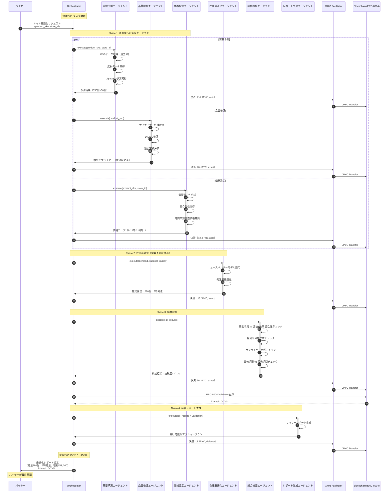
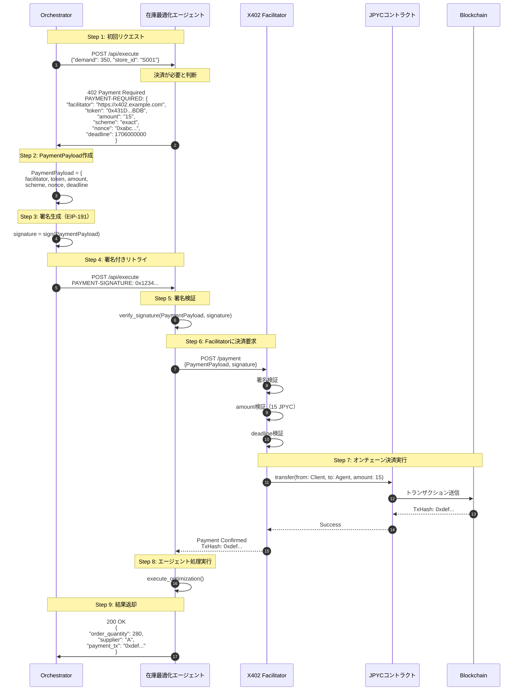
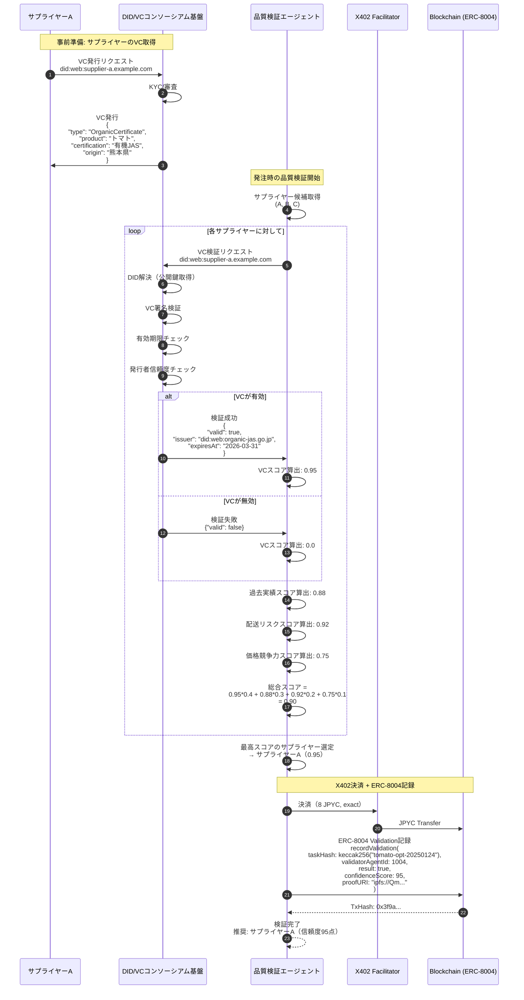
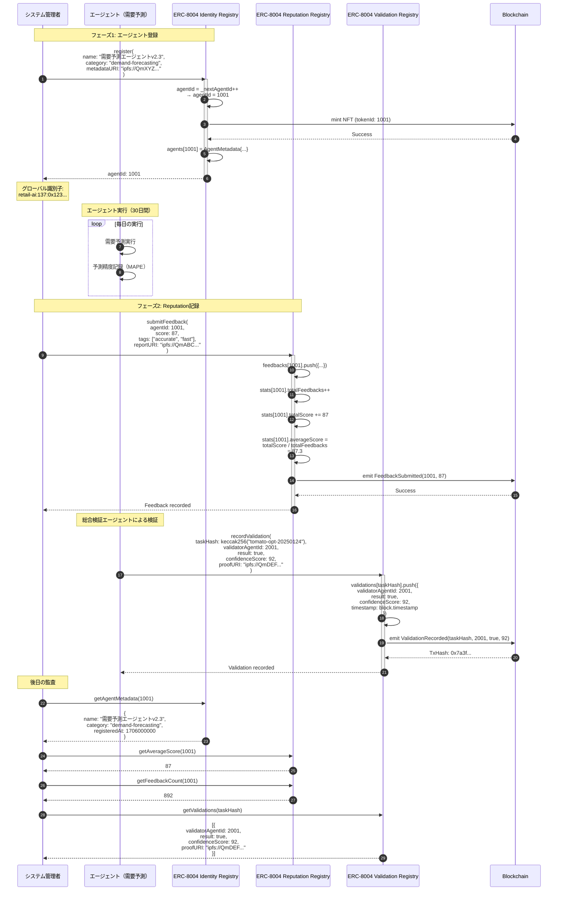
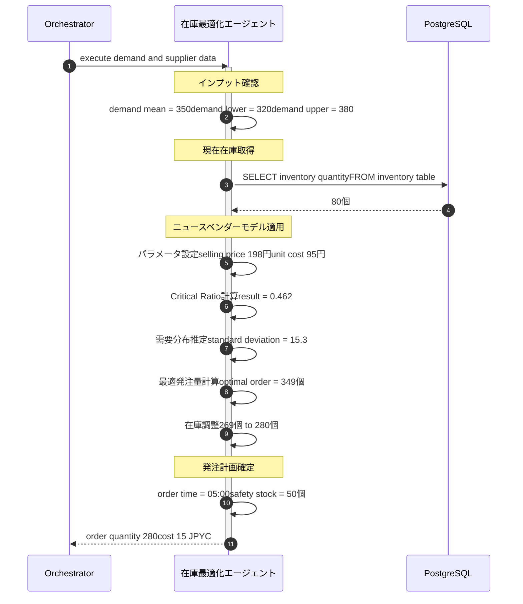

# シーケンス図 - 生鮮品サプライチェーン最適化AI協調システム

## ドキュメント情報

- **プロジェクト名**: 生鮮品サプライチェーン最適化AI協調システム
- **ドキュメントタイプ**: シーケンス図
- **バージョン**: 1.0.0
- **最終更新**: 2025-01-22

---

## 目次

1. [全体フロー（6エージェント協調）](#1-全体フロー6エージェント協調)
2. [X402決済フロー](#2-x402決済フロー)
3. [DID/VC検証フロー](#3-didvc検証フロー)
4. [ERC-8004記録フロー](#4-erc-8004記録フロー)
5. [エージェント実行詳細フロー](#5-エージェント実行詳細フロー)

---

## 1. 全体フロー（6エージェント協調）

### 1.1 概要

毎日深夜2時に実行される最適化タスクの全体フロー。6つのエージェントが協調して需要予測・在庫最適化・価格設定・品質検証を行い、最終的な意思決定サマリーを生成する。

### 1.2 シーケンス図



### 1.3 タイミング詳細

| フェーズ | 処理内容 | 所要時間 | コスト |
|---------|---------|---------|--------|
| Phase 1（並列） | 需要予測 + 品質検証 + 価格設定 | 8-10秒 | 30 JPYC |
| Phase 2 | 在庫最適化 | 5秒 | 15 JPYC |
| Phase 3 | 総合検証 + オンチェーン記録 | 3秒 | 5 JPYC |
| Phase 4 | レポート生成 | 2秒 | 5 JPYC |
| **合計** | | **約45秒** | **55 JPYC** |

---

## 2. X402決済フロー

### 2.1 概要

X402 v2プロトコルによるマイクロペイメントフロー。HTTP 402ステータスコードを活用し、署名ベースの認証で約2秒の即時決済を実現。

### 2.2 シーケンス図（exact方式の例）



### 2.3 支払いスキーム別の違い

#### exact方式（固定料金）

```json
// PAYMENT-REQUIRED ヘッダー
{
  "amount": "15",
  "scheme": "exact"
}
// クライアントは正確に15 JPYCを支払う
```

#### upto方式（従量課金）

```json
// PAYMENT-REQUIRED ヘッダー
{
  "amount": "20",     // 最大20 JPYC
  "scheme": "upto"
}
// エージェント実行後、実際のコストが計算される
// 例: データ処理量が少なければ12 JPYCで済む
// 差額8 JPYCは返金される
```

#### deferred方式（後払い）

```json
// PAYMENT-REQUIRED ヘッダー
{
  "amount": "5",
  "scheme": "deferred"
}
// セッション終了時に一括決済
// 複数のエージェント呼び出しをまとめて支払い
```

---

## 3. DID/VC検証フロー

### 3.1 概要

DID/VCコンソーシアム基盤と連携したサプライヤー認証フロー。Verifiable Credentialの検証により、産地証明・品質認証を確認する。

### 3.2 シーケンス図



### 3.3 VCデータ構造例

```json
{
  "@context": [
    "https://www.w3.org/2018/credentials/v1",
    "https://www.w3.org/2018/credentials/examples/v1"
  ],
  "id": "http://example.org/credentials/3732",
  "type": ["VerifiableCredential", "OrganicCertificate"],
  "issuer": {
    "id": "did:web:organic-jas.go.jp",
    "name": "有機JAS認証機関"
  },
  "issuanceDate": "2025-01-01T00:00:00Z",
  "expirationDate": "2026-03-31T23:59:59Z",
  "credentialSubject": {
    "id": "did:web:supplier-a.example.com",
    "product": "トマト",
    "productCode": "tomato-medium-domestic",
    "certification": "有機JAS",
    "certificationNumber": "JAS-2025-001234",
    "origin": "熊本県",
    "farm": "阿蘇農園",
    "harvestDate": "2025-01-23"
  },
  "proof": {
    "type": "EcdsaSecp256k1Signature2019",
    "created": "2025-01-01T00:00:00Z",
    "proofPurpose": "assertionMethod",
    "verificationMethod": "did:web:organic-jas.go.jp#keys-1",
    "jws": "eyJhbGciOiJFUzI1NksiLCJiNjQiOmZhbHNlLCJjcml0IjpbImI2NCJdfQ..."
  }
}
```

---

## 4. ERC-8004記録フロー

### 4.1 概要

エージェントの登録・評判記録・検証結果記録をオンチェーンで管理するフロー。3つのRegistryを活用。

### 4.2 シーケンス図



### 4.3 オンチェーンデータの関連性

```
Identity Registry (ERC-721 NFT)
├─ agentId: 1001 (需要予測エージェント)
│  └─ メタデータ: 名前、カテゴリ、ベンダー、モデル種類
├─ agentId: 1002 (在庫最適化エージェント)
├─ agentId: 1003 (価格設定エージェント)
└─ agentId: 2001 (総合検証エージェント)

Reputation Registry
├─ agentId: 1001
│  ├─ 評価件数: 892件
│  ├─ 平均スコア: 87.3/100
│  └─ タグ: ["accurate", "fast", "stable"]
└─ agentId: 1002
   └─ ...

Validation Registry
├─ taskHash: keccak256("tomato-opt-20250124")
│  └─ 検証者: agentId 2001
│     ├─ 結果: true
│     ├─ 信頼度: 92/100
│     └─ 証明: ipfs://QmDEF...
└─ taskHash: keccak256("tomato-opt-20250125")
   └─ ...
```

---

## 5. エージェント実行詳細フロー

### 5.1 需要予測エージェントの詳細



### 5.2 在庫最適化エージェントの詳細

```mermaid
sequenceDiagram
    autonumber
    participant Orch as Orchestrator
    participant IO as 在庫最適化エージェント
    participant DB as PostgreSQL
    participant Opt as 最適化エンジン

    Orch->>IO: execute demand_forecast and supplier_quality
    activate IO
    
    Note over IO: インプット確認
    IO->>IO: demand_mean = 350demand_lower = 320demand_upper = 380supplier = A, unit_price: 95円
    
    Note over IO: 現在在庫取得
    IO->>DB: SELECT inventory_quantityFROM inventoryWHERE product_sku = tomato-mediumAND store_id = S001
    DB-->>IO: 80個
    
    Note over IO: ニュースベンダーモデルパラメータ設定
    IO->>IO: selling_price = 198円unit_cost = 95円disposal_cost = 120円shortage_cost = 103円
    
    Note over IO: Critical Ratio計算
    IO->>IO: critical_ratio = shortage_cost divided by total= 103 divided by 223= 0.462
    
    Note over IO: 需要分布推定
    IO->>IO: demand_std = range divided by 3.92= 60 divided by 3.92= 15.3
    
    Note over IO: 最適発注量計算
    IO->>Opt: 正規分布パーセント点関数q=0.462, mean=350, std=15.3
    Opt-->>IO: optimal_order = 349.4
    
    IO->>IO: 現在在庫を考慮order = max value of 0 or 269結果: 269個調整後: 280個
    
    Note over IO: 発注タイミング計算
    IO->>IO: lead_time = 6時間order_time = 05:00
    
    Note over IO: 安全在庫計算
    IO->>IO: safety_stock = 350 × 0.15= 52.5 → 50個
    
    IO-->>Orch: AgentResultorder_quantity: 280confidence: 0.89cost: 15 JPYC
    deactivate IO
```

---

## 6. まとめ

### 6.1 主要フローの特徴

| フロー | 所要時間 | 主要技術 | 重要ポイント |
|--------|---------|---------|-------------|
| **全体フロー** | 約45秒 | エージェント協調 | 並列実行で高速化 |
| **X402決済** | 約2秒 | HTTP 402, 署名 | ガスレス、即時決済 |
| **DID/VC検証** | 約3秒 | 分散ID, VC | 信頼性の可視化 |
| **ERC-8004記録** | 約5秒 | NFT, オンチェーン | 監査証跡の永続化 |

### 6.2 システムの信頼性を支える仕組み

1. **並列実行**: Phase 1で3つのエージェントを同時実行し、全体処理時間を短縮
2. **段階的検証**: Phase 3で全エージェント結果の整合性を確認
3. **オンチェーン記録**: ERC-8004で検証結果を改ざん不可能な形で保存
4. **DID/VC統合**: サプライヤーの信頼性を外部認証基盤で担保

---

**作成日**: 2025-01-22  
**次回更新予定**: Phase 1実装完了時
